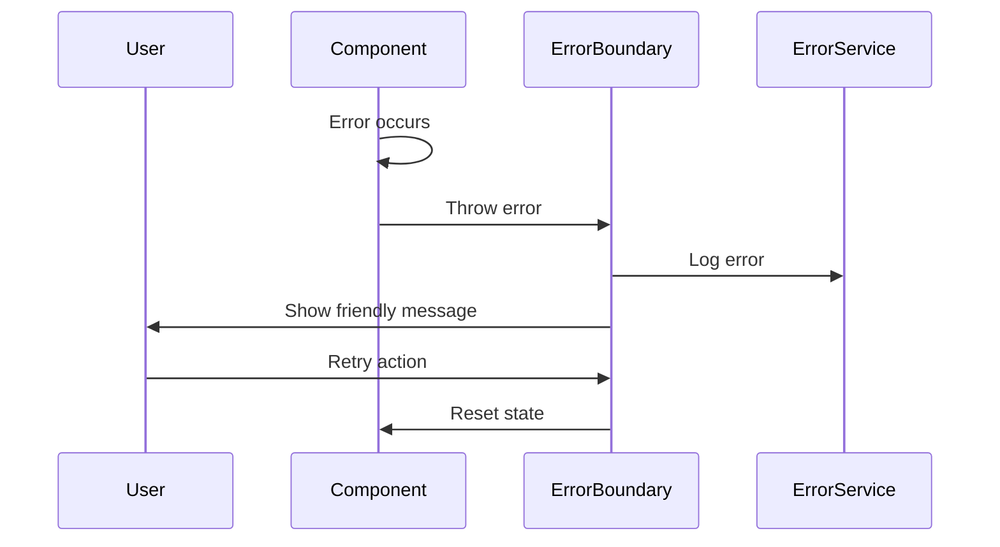

# Error Handling Strategy

## Error Flow


## Error Response Format
```typescript
interface AppError {
  code: string;
  message: string;
  details?: Record<string, any>;
  timestamp: string;
  component: string;
}
```

## Frontend Error Handling
```typescript
const GlobalErrorBoundary = ({ children }: { children: React.ReactNode }) => {
  const [hasError, setHasError] = useState(false);
  
  useEffect(() => {
    const handleError = (error: Error) => {
      console.error('Global error:', error);
      setHasError(true);
    };
    
    window.addEventListener('error', handleError);
    return () => window.removeEventListener('error', handleError);
  }, []);
  
  if (hasError) {
    return <ErrorFallback onRetry={() => setHasError(false)} />;
  }
  
  return <>{children}</>;
};
```
