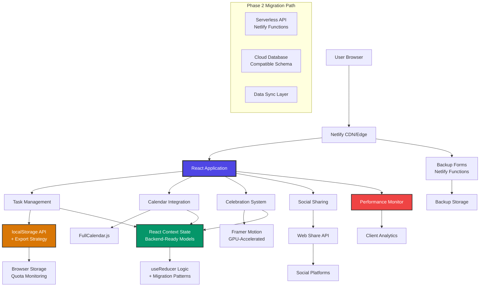

# High Level Architecture

## Technical Summary

SimpleTasks employs a **client-side monolith architecture** with localStorage persistence enhanced by proactive data backup strategies. The React 18 frontend leverages concurrent features and TypeScript for complex gesture handling, while Vite provides fast development cycles and client-side performance monitoring. The unified dashboard integrates FullCalendar.js for drag-and-drop scheduling and Framer Motion for GPU-accelerated celebration animations. This architecture achieves the PRD's core goals while addressing critical risks through backend-ready data models and progressive enhancement patterns that ensure 60fps performance and WCAG AA accessibility compliance.

## Platform and Infrastructure Choice

**Recommended Platform:** **Netlify + GitHub Integration with Performance Monitoring**

**Alternative Considerations:**
1. **Netlify + GitHub (Recommended):** 
   - **Pros:** Zero-config deployment, automatic branch previews, edge CDN, serverless functions ready for Phase 2 migration
   - **Cons:** Static hosting limits real-time features, requires client-side performance monitoring
   
2. **Vercel + GitHub:**
   - **Pros:** Excellent React optimization, edge functions, built-in analytics
   - **Cons:** More Next.js-oriented, may be overkill for client-only MVP

**Recommendation with Risk Mitigation:** Netlify provides the optimal balance of simplicity and future scalability, with serverless functions enabling seamless Phase 2 backend integration. Client-side performance tracking will monitor the 60fps animation requirement and localStorage reliability.

**Platform:** Netlify  
**Key Services:** Static site hosting, CDN, branch previews, serverless functions (Phase 2), form handling (data backup)  
**Deployment Host and Regions:** Global edge deployment with primary hosting in US East

## Repository Structure

**Structure:** Monorepo with backend-compatible organization  
**Monorepo Tool:** npm workspaces with migration path to Nx (if team scaling needed)  
**Package Organization:** Domain-driven separation preparing for future service boundaries

Repository design anticipates Phase 2 backend integration by organizing code around business domains (task management, calendar, celebrations) rather than technical layers, minimizing future refactoring.

## High Level Architecture Diagram

## Architectural Patterns

- **JAMstack Architecture:** Static React build with client-side interactivity and planned serverless API integration - _Rationale:_ Optimal performance and security while maintaining clear migration path to full-stack
- **Backend-Ready Component Design:** Atomic design with domain-driven organization and TypeScript interfaces compatible with future API integration - _Rationale:_ Minimizes refactoring when adding backend services
- **Context + Reducer with Migration Patterns:** Centralized state management designed for easy transition to server state - _Rationale:_ Avoids complexity while planning for backend integration  
- **Progressive Data Enhancement:** Core task functionality with localStorage, enhanced with backup and export strategies - _Rationale:_ Mitigates data loss risk while maintaining offline-first benefits
- **Performance-First Repository Pattern:** Abstract storage operations with client-side monitoring and quota management - _Rationale:_ Ensures 60fps performance requirements and prevents data loss scenarios

**Risk-Mitigated Architecture Decisions:**
- **Data Backup Strategy:** Proactive export prompts and form-based backup to Netlify Functions
- **Performance Monitoring:** Client-side metrics tracking frame rates and localStorage performance  
- **Migration-Ready Data Models:** Schema design anticipating backend database structure
- **Progressive Enhancement:** Accessibility-first approach with gesture fallbacks ensures broad compatibility
